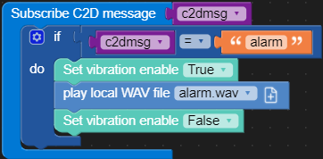

# 动手实验1：基于UIFLOW图形化编程快速接入设备数据到Azure IoT

M5Stack UIFLOW图形化编程工具让物联网设备的原型开发变得无比的简单。目前已经了支持数百种的硬件扩展模块，包括主流的传感器、I/O执行机构和通讯模块。本动手实验带你探索UIFLOW中的的Azure IoT云连接功能，利用这些模块你可以在轻松创建一个设备到云的应用。

## 目录
- [准备1：创建Azure IoT Hub和设备身份](#准备1创建azure-iot-hub和设备身份)
- [准备2：连接M5Stack Core2与UIFLOW](#准备2连接m5stack-core2与uiflow)
- [实验1-1：采集并显示传感器数据](#实验1-1采集并显示传感器数据)
- [实验1-2：连接到Azure IoT Hub并使用D2C Message发送时序数据](#实验1-2连接到azure-iot-hub并使用d2c-message发送时序数据)
- [实验1-3：使用D2C Message发送事件到IoT Hub](#实验1-3使用d2c-message发送事件到iot-hub)
- [实验1-4：使用C2D Message通道向设备发送指令](#实验1-4使用c2d-message通道向设备发送指令)
- [实验1-5：使用Direct Method执行设备远程调用并返回结果](#实验1-5使用direct-method执行设备远程调用并返回结果)
- [实验1-6：使用Device Twin实现设备状态的同步](#实验1-6使用device-twin实现设备状态的同步)

## 准备1：创建Azure IoT Hub和设备身份

1. 使用你的账号登陆 **portal.azure.com**，如果您使用的是Azure在中国境内的云，地址是 **portal.azure.cn**
   
2. 在你的订阅里创建一个IoT Hub服务，详细步骤可以参考文档：[创建IoT Hub](https://docs.microsoft.com/en-us/azure/iot-hub/iot-hub-create-through-portal)

3. 在IoT Hub中注册一个使用 **Symmetrical Key** 认证的设备身份，详细步骤参考文档：[注册设备](https://docs.microsoft.com/en-us/azure/iot-hub/iot-hub-create-through-portal#register-a-new-device-in-the-iot-hub)

4. 在IoT Hub页面左侧选择 **Shared access policies**，点击内置的 **iothubowner** 并在展开的页面中找到 **Primary connection string** 拷贝到剪切板中。

5. 打开Azure IoT Explorer，点击 **+ Add connection**，复制上一步的拷贝下来的 **iothubowner connection string** 到对话框保存后，添加该IoT Hub到主页。
   
6. 接下来你可以作为服务端管理员的身份使用Azure IoT Explorer工具对设备进行管理。

## 准备2：连接M5Stack Core2与UIFLOW

> Core2与UIFLOW之间通过网络连接，程序脚本的下载和资源的上传都是通过网络。在设备上会随机生成API KEY，用户通过TFT或命令行获取API KEY后，从UIFLOW上与设备建立一对一的通讯。

1. 长按设备左侧电源键2秒开机，设备启动后自动连接预先配置的WiFi AP。

   > 设备会停留在配置界面前几秒钟，此时如果触碰屏幕会进入设置模式。如果不慎进入到该模式下，短按设备下方的复位键可重启设备

2. 等待WiFi AP和UIFLOW连接成功后，在TFT屏幕上方的状态栏会显示两个绿色的图标（无线信号和云），在TFT屏幕中间会显示该设备的 **API KEY**

3. 使用浏览器打开[UIFLOW](https://flow.m5stack.com/), 点击左下角 **API KEY** 图标后打开设备连接页面，输入API KEY，选择Core2与你喜欢的主题颜色，点击 **OK** 确认
   
    
   
4. 若连接成功，在UIFLOW右上方会产生 **Connected** 通知消息，并且在左下角 **API KEY** 图标上也会显示绿色的 **connected** 字样。

## 实验1-1：采集并显示传感器数据

### 实验目的:

每5秒更新ENV II中的温度、湿度和大气压力数值并显示在Core2的TFT屏幕上。

### 实验步骤：

1. 连接ENV II unit传感器到Core2上的 **PORTA**（左侧没有丝印的端口)。

2. 在UIFLOW左侧 **Units** 字样下方点击 + 图标，在弹出的窗口中选择 **ENV II** 和 **PORTA** 进行添加。

    

3. 从UIFLOW最左侧控件栏上添加一个 **Label** 控件到虚拟屏幕上，单击打开属性面板，修改 **text** 为 **Temperature**，同理循环添加 **Humidity** 和 **Press** 标签。完成后再拖拽3个Label控件到各个标签的右侧，记下他们的各自 **name**。

    

4. 添加 **Event->Loop** 块放置在 **Setup** 后，在 **Loop** 中添加 **Timer->Wait (n) s** 块，实现5秒延时。

5. 添加 **UI->Label->Label...show...** 块到 **Loop** 中，选择上一步记下的三个标签 **name** ，再添加三个 **Units->ENV->Get Temperature/Humidity/Pressure** 功能块赋值给相应的标签。

    

6. 点击右上角 **RUN** 图标下载程序到Core2运行。

7. 观察设备界面上参数变化。

## 实验1-2：连接到Azure IoT Hub并使用D2C Message发送时序数据

### 实验目的:

每5秒读取一组新的传感器数据向IoT Hub发送。

### 实验步骤：

1. 打开Azure IoT Explorer，点击首页上之前创建的IoT Hub的链接进入Hub管理页面，继续选择之前创建的设备ID进入设备页面，在设备页面中复制 **primary connection string** 到剪切板。

    

2. 在UIFLOW中添加 **IoTCloud->Azure->IoT Hub** 块，串接在 **Setup** 后。保持默认 **SAS** 认证模式不变，把上一步中复制的 **primary connection string** 到字符串粘贴到此。

3. 添加 **IoTCloud->Azure->Start azure** 块，串接上一步后面，连接Azure。

    > 该功能块是一个阻塞调用，直到返回连接成功或者失败后面的逻辑才能得到执行。

4. 创建 **temperature**, **humidity**, **pressure** 三个变量，将实验1-1中添加创建的 **Get Temperature/Humidity/Pressure** 块赋值给变量，再降变量值替换1-1中创建的三个标签的值。

5. 使用 **map->create map** 块，增加3个键值对，用于表示传感器数据，同时map赋值给一个新建的变量 **telemetry** 串接在上一步。

    键 | 值
    ------------ | -------------
    "Temperature" | temperature (变量)
    "Humidity" | humidity
    "Pressure" | pressure 

6. 使用 **JSON->dumps to json** 块将map变量转换为json字符串后填入  **IoTCloud->Azure->Publish D2C message** 块，串接上一步。

    

7.  点击右上角 **RUN** 图标下载程序到Core2运行。

8.  进入Azure IoT Explorer，在设备管理界面左侧选择 **telemetry**, 在新打开页面上点击 **Start** 开始从IoT Hub中读取数据。

    


## 实验1-3：使用D2C Message发送事件到IoT Hub

### 实验目的:

每1秒检测PIR传感器事件并向IoT Hub发送。

### 实验步骤：

1. 连接PIR unit传感器到 Core2 底座上的 **PORTB**。

2. 在UIFLOW左侧 **Units** 字样下方点击 + 图标，在弹出的窗口中选择 **PIR** 和 **PORTB** 进行添加。

    

3. 从UIFLOW最左侧控件栏上添加一个新的 **Label** 控件到虚拟屏幕上，单击打开属性面板，修改 **text** 为 **PIR**，完成后再添加1个Label控件到PIR标签的右侧，用于表示PIR的值（0 or 1)，记下他的 **name**。

    

4. 拖动 **Event->timer callback (timer1)** 定时器块放置在任意位置，同时添加一个 **Event->Start (timer1) period (100) ms mode (Periodic)** 块在上一步的 **Azure Start** 块后、 **Loop** 块前的位置，修改定时器触发周期到 **1000** ms。

5. 创建一个 **pir** 变量，在 **Setup** 后添加 **Variables->Set PIR to** 块赋初值为 **0**。
   
6. 添加一个 **Logic->If...do...** 块在timer1定时器事件中，在 **if** 判断处衔接 **Logic->..=..** 比较块，比较 **pir** 变量与 **Units->PIR->Get (pir0) status** 的值。当前两 **不等** 的时候执行If块中的逻辑。
   
   1. 通过 **Variables->Set PIR to** 块将 **Get (pir0) status** 的值赋值给 **pir** 变量。
   
   2. 添加 **UI->Label->Label...show...** 块将TFT屏幕上的界面中 **PIR** 值更新。

   3. 使用 **map->create map** 块，增加1个键值对，用于表示PIR检测事件，使用 **JSON->dumps to json** 块将map直接转换为json字符串后填入  **IoTCloud->Azure->Publish D2C message** 块，串接上一步。

        键 | 值
        ------------ | -------------
        "PIR new value" | pir (变量)

    

    

7.  点击右上角 **RUN** 图标下载程序到Core2运行。

8.  进入Azure IoT Explorer，在设备管理界面左侧选择 **telemetry**, 在新打开页面上点击 **Start** 开始从IoT Hub中读取数据，将PIR传感器远离移动物体，手动触发再观察PIR事件。

    

## 实验1-4：使用C2D Message通道向设备发送指令

### 实验目的:

利用IoT Hub的 **C2D Message** 能力发送消息给设备产生本地报警

### 实验步骤：

1. 添加 **IoTCloud->Azure->Subscribe C2d Message** 块放置在任意位置。

    > 注意该功能块属于事件类型，无需与其他块接在一起。当事件触发后，该块包含的功能会被激活。

2. 添加 **Logic->if..do..** 块在 **C2D** 块内部并在 **if** 判断处衔接 **Logic->..=..** 比较块。左值使用 **c2dmsg** 变量，右值使用一个 **Text** 字符串赋值为 **"alarm"**。

3. 在if块内部，使用两个 **Hardwares->Vibration->Set vibration enable** 块实现震动开(True)和关(False)，中间包夹 **Hardwars->Speaker->Play local WAV file null +** 块实现声音报警。

4. 下载根目录下 **res** 文件夹中的 [alarm.wav](res/alarm.wav) 文件到本地文件系统，点击WAV块上的 + 图标添加该文件 ，通过UIFLOW上传到Core2内部文件系统。等待10-20秒完成上传后，在WAV块下拉菜单中可以选中该文件。

    

5. 点击右上角 **RUN** 图标下载程序到Core2运行。

6.  回到Azure IoT Explorer中，在设备管理界面左侧选择 **Cloud to Device message**, 在新打开页面中的 **Message body** 窗口输入 **alarm**，点击上方 **Send message to device** 按钮发送。

    

7.  观察设备报警情况。

## 实验1-5：使用Direct Method执行设备远程调用并返回结果

### 实验目的:

利用IoT Hub的 **Direct Method** 能力读取电池剩余电量

### 实验步骤：

1. 拖动 **IoTCloud->Azure->Subscribe direct method** 块放置在任意位置，填入函数名 **get_battery**。

    > 函数名可以任取，在Azure IoT Explorer中与之对应即可。

2. 添加 **Hardwares->Power->Get battery percentage** 块串接在 **direct method** 块的返回 **body** 后面。

    

3. 点击右上角 **RUN** 图标下载程序到Core2运行。

4.  回到Azure IoT Explorer中，在设备管理界面左侧选择 **Direct method**, 在新打开页面中的Method name处输入 **get_battery**，点击上方 **Invoke method** 按钮触发。

    

5. 在Azure IoT Explorer右上方的通知消息可以看到设备返回的状态码和返回值，下面截图表示设备当前电量为100%。

    

## 实验1-6：使用Device Twin实现设备状态的同步

### 实验目的:

利用IoT Hub的 **Device Twin** 能力实现设备RGB灯状态的同步

### 实验步骤：

1. 从UIFLOW最左侧控件栏上拖拽一个 **Label** 控件到虚拟屏幕上，单击打开属性面板，修改 **text** 为 **LED**，再添加一个 **switch** 控件，放置在LED标签的右侧位置，表示该控件用于控制LED的开与关。

2. 添加两个 **UI->Switch->Switch on/off** 块放置在任意位置，分别选择 **on** 和 **off**。

3. 在 **Swtich on** 块中添加 **Hardwares->RGB->Set RGB bar color** 块和 **Set RGB brightness** 块，根据喜好选择合适的颜色和亮度。在后面再添加一个 **IoTCloud->Azure->Update twin reported properties** 块，点击 + 号增加一个键值对。左边填写 **LED**，右边填写 **ON**。

    > 注意这里左值应直接填写，不要使用text字符串。

4. 类似操作实现 **Switch off** 块的设计，注意 RGB brightness 为0时表示关闭RGB LED。

    

5. 点击右上角 **RUN** 图标下载程序到Core2运行。

6. 点击Core2 TFT触摸屏幕上的 **Switch** 控件可以控制底部RGB灯的亮灭。

7. 进入Azure IoT Explorer，在设备管理界面左侧选择 **Device twin**, 在新打开页面中的可以看到该设备 **Twin** 全部内容，在 **properties->reported** 字段可以看到与当前设备RGB灯状态对应的属性和值。点击 **refresh** 可以刷新该文档。

    ```
    {
        ...
        "properties": {
            "reported": {
                "LED": "ON", // "OFF"
                ...
            }
        }
    }
    ```

    

> 这一步我们已经成功将设备RGB灯的状态同步到了云端，现在我们要使用Device Twin从云端来控制设备RGB灯的亮灭，并且实现状态同步。

8. 再次回到UIFLOW，添加 **IoTCloud->Azure->Subscribe twin desired payload** 块到屏幕任意位置。

9. **twinmsg** 变量中保存了服务端下发json文档，它代表的是 **desired** 和 **reported** 字段的中差异化的内容。在这里我们要解析这个json，从中搜索是否有有我们关心内容产生了变化。
   
   1. 使用 **JSON->loads json** 块将 **twinmsg** 变量转换为 **map** 类型。
   2. 使用 **Map->get key in map** 块从map中获取 **LED** 键值。
   3. 使用 **Logic->Switch** 块，接入上一步返回的值作判断。
   4. 如果键值等于 **ON**，表示服务端要求控制打开RGB LED，此时除了添加第3步中相同打开RGB LED灯和上报 **reported** 状态的块（也可以使用函数），再多增加一个 **UI->Switch->Set switch(n) ON** 同步界面上的控件显示效果。
   5. 如果键值等于 **OFF**，同理实现RGB LED关闭、上报和控件同步。
   
    

9. 点击右上角 **RUN** 图标下载程序到Core2运行。

10. 在Azure IoT Explorer中，在设备管理界面左侧选择 **Device twin**, 在新打开页面中的可以看到该设备 **Device Twin** 文档，在 **properties->desired** 字段下增加&修改 **"LED": "ON"** 或 **"LED": "OFF"**，点击 **Save**

    ```
    {
        ...
        "properties": {
            "desired": {
                "LED": "ON", // "OFF"
                ...
            }
            "reported": {
                "LED": "ON", // "OFF"
                ...
            }
        }
    }
    ```
11. 观察到设备的RGB LED灯变化，同时点击Azure IoT Explorer界面上的 **refresh** 按钮查看Device twin的中 **reported** 字段是否被同步。

    

## 资料

- [本实验参考代码](res/m5workshop-v0.1.m5f)
- [Azure IoT 中文文档](https://docs.microsoft.com/zh-cn/azure/iot-hub/)
- [M5Stack官网](https://m5stack.com/)