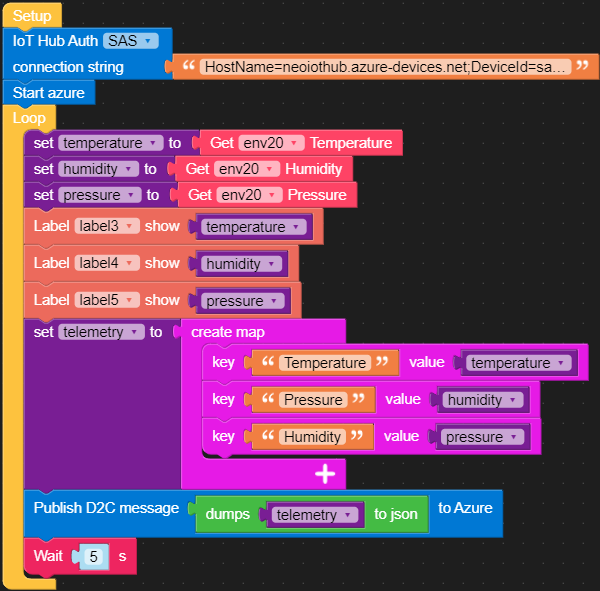

# 动手实验1：基于UIFLOW图形化编程快速接入设备数据到Azure IoT

M5Stack UIFLOW图形化编程工具让物联网设备的原型开发变得无比的简单。目前已经了支持数百种的硬件扩展模块，包括主流的传感器、I/O执行机构和通讯模块。本动手实验带你探索UIFLOW中的的Azure IoT云连接功能，利用这些模块你可以在轻松创建一个设备到云的应用。

## 准备1：创建Azure IoT Hub和设备身份

1. 使用你的账号登陆 portal.azure.com，如果您使用的是Azure在中国境内的云，地址是 portal.azure.cn
   
2. 在你的订阅里创建一个IoT Hub服务，详细步骤可以参考文档：[创建IoT Hub](https://docs.microsoft.com/en-us/azure/iot-hub/iot-hub-create-through-portal)

3. 在IoT Hub中注册一个使用Symmetrical Key认证的设备身份，详细步骤参考文档：[注册设备](https://docs.microsoft.com/en-us/azure/iot-hub/iot-hub-create-through-portal#register-a-new-device-in-the-iot-hub)

4. 在IoT Hub页面左侧选择 **Shared access policies**，点击内置的 **iothubowner** 并在展开的页面中找到 **Primary connection string** 拷贝到剪切板中。

5. 打开Azure IoT Explorer，点击 **+ Add connection**，复制上一步的拷贝下来的iothubowner connection string到对话框保存后，可添加加该IoT Hub到主页。
   
6. 接下来你可以作为服务端管理员的身份使用Azure IoT Explorer工具对设备进行管理。

## 准备2：连接M5Stack Core2与UIFLOW

> Core2与UIFLOW之间通过网络连接，程序脚本的下载和资源的上传都是通过网络。在设备上会随机生成API KEY，用户通过TFT或命令行获取API KEY后，从UIFLOW上与设备建立一对一的通讯。

1. 长按设备左侧电源键2秒开机，设备启动后自动连接预先配置的WiFi AP。

   > 设备会停留在配置界面前几秒钟，此时如果触碰屏幕会进入设置模式。如果不慎进入到该模式下，短按设备下方的复位键可重启设备

2. 等待WiFi AP和UIFLOW连接成功后，在TFT屏幕上方的状态栏会显示两个绿色的图标（无线信号和云），在TFT屏幕中间会显示该设备的**API KEY**

3. 使用浏览器打开[UIFLOW](https://flow.m5stack.com/), 点击左下角**API KEY**图标后打开设备连接页面，输入API KEY，选择Core2与你喜欢的主题颜色，点击**OK**确认
   
    
   
4. 若连接成功，在UIFLOW右上角会产生**Connected**通知消息，并且在左下角**API KEY**图标上也会显示绿色的**connected**字样。

## 实验1-1：采集并显示传感器数据

### 实验目的:

读取ENV II中的温度、湿度和大气压力数值显示在Core2的TFT屏幕上。

### 实验步骤：

1. 连接ENV II unit传感器到Core2上的PORTA（左侧没有丝印的端口)。

2. 在UIFLOW左侧 Units 字样下方点击 + 图标，在弹出的窗口中选择ENV II和PORTA进行添加。

    

3. 从UIFLOW最左侧控件栏上拖拽一个Label控件到虚拟屏幕上，单击打开属性面板，修改**text**为**Temperature**，同理循环添加**Humidity**和**Press**标签。完成后再拖拽3个Label控件到各个标签的右侧，记下他们的各自**name**。

    

4. 拖出 **UI->Label** 下的显示块(Label...Show...) 到**Setup**下，选择对应的标签序号，再从 **Units->ENV** 下找到**Get Temperature/Humidity/Pressure** 功能块给标签赋值。重复三次添加完成。
   
    

5. 点击右上角**RUN**图标下载程序到Core2运行。

6. 挑战！利用Loop和Timer功能块实现一个每5秒更新环境温湿度气压的应用。

## 实验1-2：连接到Azure IoT Hub并使用D2C Message发送时序数据

### 实验目的:

每5秒读取一组新的传感器数据向IoT Hub发送，同时更新TFT屏幕上的数值。

### 实验步骤：

1. 打开Azure IoT Explorer，点击首页上之前创建的IoT Hub的链接进入Hub管理页面，继续选择之前创建的设备ID进入设备页面，在设备页面中复制**primary connection string**到剪切板。

    

2. 在UIFLOW中 **IoTCloud->Azure->IoT Hub** 块，串接在**Setup**后。保持默认**SAS**认证模式不变，把上一步中复制的conection string到字符串粘贴到此。

3. 拖出 **IoTCloud->Azure->Start azure** 块，串接上一步IoT Hub块，连接Azure。

    > 该功能块是一个阻塞调用，直到返回连接成功或者失败后面的逻辑才能得到执行

4. 创建**temperature**, **humidity**, **pressure**三个变量，拖出**Loop**块接在**Start Azure**后，在Loop中将ENV II的取值块对接到各个变量上。
   
5. 将实验1-1中创建的三个标签显示块中的值用上一步创建的变量替代。

6. 拖出 **map->create map** 块，创建3个键值对，用于表示传感器数据。将map赋值给一个新建的变量**telemetry**并放置在变量初始化动作后。

    键 | 值
    ------------ | -------------
    "Temperature" | temperature (变量)
    "Humidity" | humidity
    "Pressure" | pressure 

7. 使用 **JSON->dumps to json** 块将map变量转换为json字符串后填入 **ioTCloud->Azure->Publish D2C message**块，串接上一步。

8. 添加 **Timer->delay (n) s** 块串接上一步，在Loop中实现5秒延迟和循环。

    

9.  点击右上角RUN图标下载程序到Core2运行。

10. 回到Azure IoT Explorer中，在设备管理界面左侧选择**telemetry**, 在新打开页面上点击**Start**开始从IoT Hub中读取数据。

## 实验1-3：使用C2D Message通道向设备发送指令

### 实验目的:

利用IoT Hub的C2D Message能力发送消息给设备产生本地报警信号

### 实验步骤：

1. 拖出 **IoTCloud->Azure->Subscribe C2d Message** 块放置在任意位置

    > 注意该功能块属于事件类型，无需与其他块接在一起即可使用。当事件触发后，该块包含的功能才被调用。

2. 放置 **Logic->if..do..** 块在内部并在 if 判断处衔接 **Logic->..=..** 块。左值使用c2dmsg变量，右值使用一个**Text**字符串赋值为"alarm"。

3. 在if块内部，使用 **Hardwares->Vibration->Set vibration enable** 块和 **Timer->delay (n) s** 块实现震动2秒报警。

    

4. 点击右上角RUN图标下载程序到Core2运行。

5.  回到Azure IoT Explorer中，在设备管理界面左侧选择 **Cloud to Device message**, 在新打开页面中的Message body部分输入 **alarm**，点击上方 **Send message to device** 按钮发送。

    

6.  观察设备震动报警情况。

## 实验1-4：使用Direct Method执行设备远程调用并返回结果

## 实验1-5：使用Device Twin实现设备状态的同步
