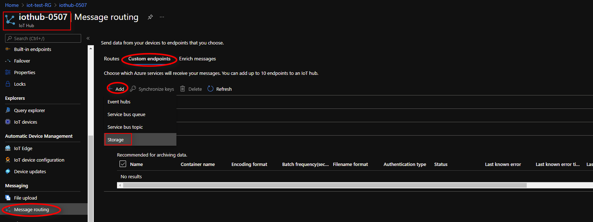

# Lab2: Visualize M5Stack telemetry data on Azure

## Prerequisites:
- Completed [Lab1 - 基于UIFLOW图形化编程快速接入设备数据到Azure IoT](https://github.com/xiongyu0523/quick-and-easy-azure-iot-development-with-m5stack-workshop/blob/main/Lab-1.md). If you haven't, please do so.
- Azure Susbscription
- Azure IoT Hub: created in Lab1
- Visual Studio Code - optional
- M5Stack: keep running and sending telemetry to Azure IoT Hub

## Lab 2-1：Routing messages to Azure Blob Storage

Message routing enables sending telemetry data from your IoT devices to built-in Event Hub-compatible endpoints or custom endpoints such as **blob storage, Service Bus Queues, Service Bus Topics, and Event Hubs**. To configure custom message routing, you create routing queries to customize the route that matches a certain condition. Once set up, the incoming data is automatically routed to the endpoints by the IoT Hub. If a message doesn't match any of the defined routing queries, it is routed to the default endpoint.

In this lab, we will route the telemetry data from M5Stack to the Azure Blob Storage.

### 1. Set up an Azure Storage Account

Login to your Azure Portal, click `+ Create a resource`, enter `Storage account`, then click `Create`. 

Follow below settings to create a new storage account. Try to use the existing Resource Group and same region where you created the IoT Hub in Lab 1. 

Click `Review and create`.

Once the depoayment is complete, click `Go to resource`.

On Storage account blade, click `Data storage` -> `Containers` -> `+ Container`. Enter a name for the New container, and then click `Create`.

Once created, you should see the container listed as below.

### 2. Set up routing endpoints

From Azure Portal, navigate to Azure IoT Hub you created in Lab 1. 

Click `Messaging` -> `Message routing` -> `Custom endpoints` -> `+ Add`.

On `Add a storage endpoint` blade, enter `Endpoint name`, and then `Pick a container` -> Select the container created in step 1 -> click `Create`.

Once created, you shall see:

### 3. Set up routing endpoints

Click `Routes` -> `+ Add`.

Follow below screenshot to `Add a route`.

### 4. View the routed messages

Navigate to `Storage account` blade -> `Data storage -> Containers` -> click container created earlier `m5telemetry`. You may see a folder like this.

Keep clicking folder name to the blob level. You will see a few blobs created as below.

Try to download one of the blobs to local.

View the downloaded .avro file in a text editor, ideally in VS Code. 

If you haven't installed VS Code, you may download it from [HERE](https://code.visualstudio.com/sha/download?build=stable&os=win32-x64-user).

## Lab 2-2: Visualize telemetry in TSI

### 1. Route telemetry to Event Hub

#### 1.1 Create an Event Hub Namespace

Go back to Azure Portal. Click `+ Create a resource` -> Search `Event Hubs` -> Click `Create`.

On `Create Namespace` blade, Select existing `Resource Group`, enter a `Namespace name` -> Location: `Southeast Asia` -> Pricing tier: `Standard` -> `Review + create`.

Once deployment is complete, click `Go to resource` to the `Event Hubs Namespace` page.

#### 1.2 Create an Event Hub Instance

Click `+ Event Hub`, enter name: `eventhub-0508` -> click `Create`. 

Once created, go to `Event Hub Namespace` page -> `Entities -> Event Hubs` ->  click `eventhub-0508` -> `+ Consumer group` -> enter Name: `m5-tsi-cg` -> click `Create`.

Once created, you will see:

Click `Settings` -> `Shared access policies` -> `+ Add`. On Add SAS Policy blade, enter Policy name: `eventhub-0508-policy` -> tick `Manaage` -> click `Create`.

#### 1.3 Create new custom endpoint

Go to IoT Hub -> `Messaging` -> `Message routing` -> `Custom endpoints` -> `+ Add` -> `Event hubs` -> Endpoint name: `m5-telemetry-to-eventhub` -> select existing Event hub namespace: `eventhubs` -> select existing Event hub instance: `eventhub-0508` -> click `Create`.

Once created, you will see endpoints shown as below.

#### 1.4 Create new route

Click `Routes` -> `+ Add` -> enter Name: `route-to-evenhub` -> select existing endpoint: `m5-telemetry-to-eventhub` -> Data source: `Device Telemetry Messages` ->  click `Save`.

You should see the new route is shown as below:

#### 1.5 Verify event hub routing

You may verify if the routing works using Azure IoT Explorer.

### 2. Create TSI Environment

Go back to Azure Portal. Click `+ Create a resource` -> Search `Time Series Insights` -> Click `Create`.

Select the `Resource Group` you created ealier -> enter Environment name: `m5stack-tsi` -> location: `Southeast Asia` -> enter Property name: `m5stack` -> enter Storage account name: `tsistorage0508` -> click `Next: Event Source`.

On `Event Source` blade -> Source type: `Event Hub` -> enter a name:`eventhub-source` -> select Subscription -> select existing event hub namespace: `eventhubns0508` -> Event hub name: `eventhub-0508` -> Event Hub access access policy name: `iothubroutes_iothub-0507`-> Event Hub consumer group: `m5-tsi-cg` -> click `Review + Create`.

### 3. View data on TSI Explorer

Once deployment is complete, click `Go to resource` to TSI Environment. You will see the Ingress Recived messages, Ingress Received Bytes, Property Count, etc, shown as below:

click `Go to TSI Explorer`. The TSI Explorer is opened in a separated window.

If you have multiple TSI instances, you should select the one you created `m5stack-tsi` earlier.

#### 3.1 Change TSI insance name

Click `Model` -> `Instance` -> `Actions` -> click `Edit instance` -> Enter Name: `m5stack` -> `Save`.

#### 3.2 Add variables

Click `Analyze` -> `m5stack` -> tick `Humidity`, `Pressure`,`Temperature` -> click `Add`. 

### 3.3 View and export the real-time telemetry data

You may view the data in different line chart, Zoom in/out, view as a table, Connect to Power BI, etc.

** [END OF the LAB]**

